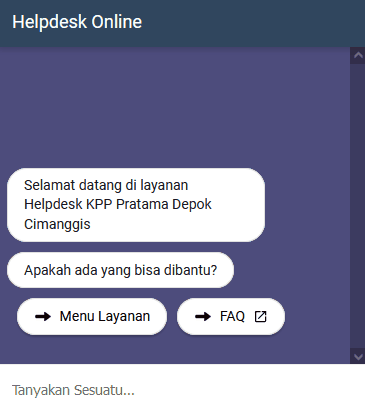

# About
The purpose of building a website-based helpdesk application to facilitate taxpayers in obtaining information from the KPP. This website applies a chatbot as a means for taxpayers to obtain information. This application using [Django](https://www.djangoproject.com/) Framework and [Dialog Flow](https://cloud.google.com/dialogflow/docs) to train and sending respondes to users.

# Screenshots
## Main Page

## Chatbot Features


# How To Install
1. Make sure you have Python 3.8 or later.
2. Install Requirements from requirements.txt
    ``` 
    pip -m install requirements.txt
    ```
3. Enjoy the website :smiley::smiley::smiley: